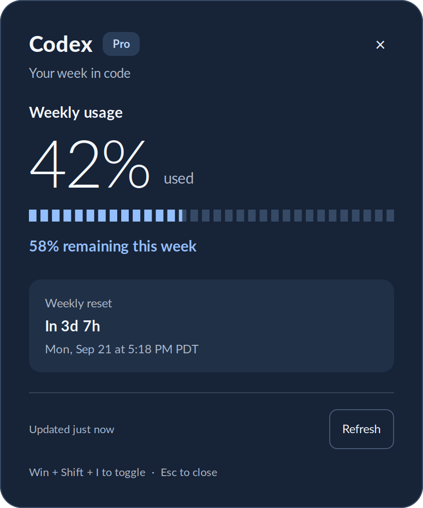

# Codex Usage Widget

A native Linux popup for your **weekly Codex usage**, one shortcut away.

**Win + Shift + I** opens the widget. Press **Esc** or click elsewhere to dismiss it.
It shows the percentage used, remaining quota, your plan, and when the week resets.



## Install

Requires Linux with GNOME, Python 3.10+, [uv](https://docs.astral.sh/uv/), and a
Codex ChatGPT login. On Ubuntu, install GTK support if needed:

```sh
sudo apt install python3-gi python3-gi-cairo gir1.2-gtk-3.0

git clone https://github.com/musel25/codex-usage-widget.git
cd codex-usage-widget
./install.sh
```

The installer creates a uv environment using the system Python so it can access
GTK. It adds local launchers, a desktop application entry, and **Super+Shift+I**
(the Windows key is Super). Existing GNOME shortcuts are preserved; installation
stops if that key combination is already in use.

Sign in using `codex login` if you have not already. No pasted tokens, API key,
browser cookies, or separate configuration file are required. The repository must
remain at its installed location; rerun `./install.sh` after moving it.

## Use

| Action | Shortcut or command |
| --- | --- |
| Open / toggle popup | **Win + Shift + I** |
| Close popup | **Esc**, close button, or click elsewhere |
| Refresh | **R** or Refresh button |
| Launch from terminal | `~/.local/bin/codex-usage-widget` |
| Keep a regular window open | `~/.local/bin/codex-usage-widget --window` |
| Terminal usage summary | `~/.local/bin/codex-usage` |
| Normalized JSON | `~/.local/bin/codex-usage --json` |

You can also run directly from the repository:

```sh
uv run python codex_usage_widget.py
uv run python codex_usage_cli.py
uv run python -m unittest discover -s tests -v
```

The last successful result appears immediately while a fresh request runs in the
background. A window left open refreshes every five minutes. Failed requests keep
saved values visibly marked **stale**. Missing weekly limits show “not reported,”
never a fabricated zero. A five-hour quota is shown only when the account returns it.

## Authentication and data

The widget reads the current access token and account ID from
`$CODEX_HOME/auth.json`, or `~/.codex/auth.json` by default, on each request. It sends
them only to `https://chatgpt.com/backend-api/wham/usage`. Redirects are blocked.
It never changes your Codex login or stores credentials in its cache. If login
expires, run `codex login` and refresh the widget.

Only normalized usage and its fetch time are cached privately beneath
`$XDG_CACHE_HOME/codex-usage-widget` (default `~/.cache/codex-usage-widget`), scoped
to your account. Weekly windows are recognized by their seven-day duration, whether
returned as a primary or secondary limit.

This is an unofficial widget using the endpoint supplied by ChatGPT. That endpoint
and its response may change. API-key-only Codex logins do not provide ChatGPT usage.

## Desktop behavior

The popup uses XWayland on GNOME when available for reliable centered placement
and window hints, matching the companion
[Claude Usage Widget](https://github.com/musel25/claude-usage-widget).
GTK must come from the same system Python used to create `.venv`. If an existing
virtual environment cannot import `gi`, recreate it with
`uv venv --python /usr/bin/python3 --system-site-packages --clear`, then `uv sync`.

To remove the keyboard shortcut, open **Settings → Keyboard → Custom Shortcuts**
and remove **Codex Weekly Usage**. Delete the two launchers in `~/.local/bin` and
`codex-usage-widget.desktop` from `~/.local/share/applications` to uninstall the
integration. No background service is installed.
